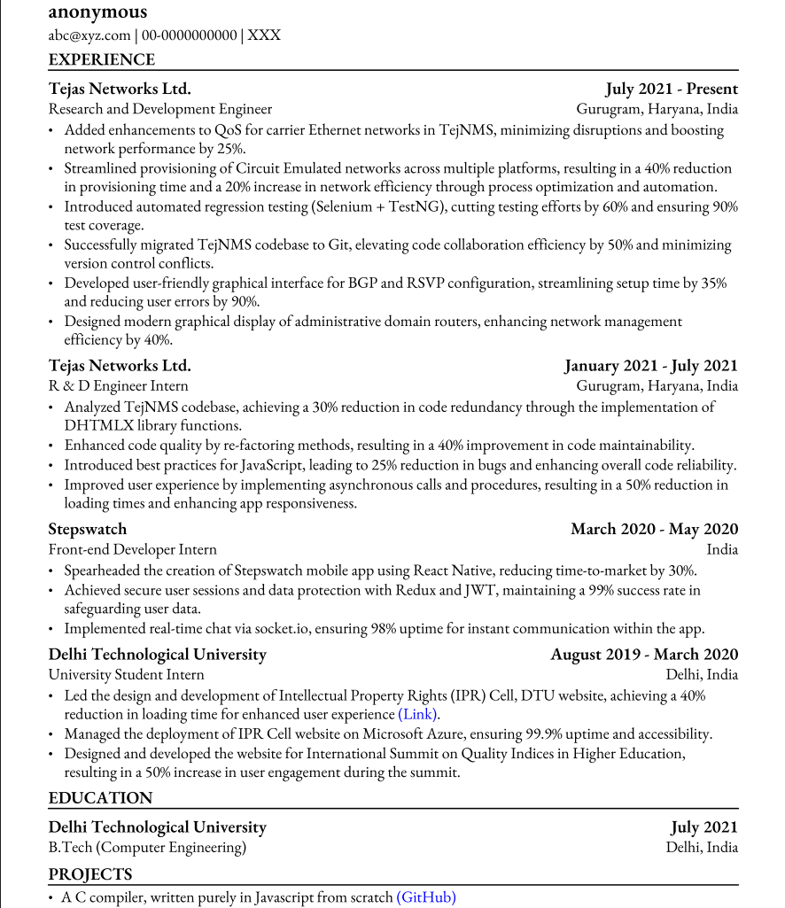

# Resume in python (using reportlab) [](https://opensource.org/licenses/MIT)

This is an attempt to create an ATS friendly resume in python. I'm intending to maintain and enhance it as per my needs, or in case I get any feedback from the community. I'm trying to keep the code simple and easy to comprehend, and separating the data from the PDF generation logic. All the data that needs to be put in the resume is present in the ```data.json``` file

## Steps to run (Old school, with hassle of dependency management)
- Make sure you have python version 3 installed
- Clone this repository
- Create a virtual environment by running the command ```python3 -m venv env```
- Activate the virtual environment by running the ```activate``` script for your respective operating system 
- Install all the required libraries by running ```pip install -r requirements.txt```
- Create a ```config.ini``` file as follows:

```
[global]
debug = false
author = <Your name>
email = <Your email>
address = <Your address>
phone = <Your phone number>
```
This will set the debug configuration as false, which will generate the resume without any grid lines. If debug is set to `true` it will generate the resume with gridlines
- Navigate inside the `src` directory by running ```cd src/```
- Run the ```main.py``` file by executing the command ```python3 main.py```. This will generate a resume in PDF format with the name ```output.pdf``` in the current directory
- To customize the information in resume, just modify the ```data.json``` file with your required information
- Personal information would be picked up from the ```config.ini``` file that is present in the project root

## Steps to run (Zero hassle, containers for the win!)
- Install `docker` and `docker-compose` on your machine by following the instructions mentioned on the official website of [Docker](https://docs.docker.com/engine/install/)
- Configure the `config.ini` file in the same way as the old school, but at `src/constants` directory
- That's it. Run `docker compose up --build` to fetch the image, install all dependencies, run the code, and generate the resume inside `src/` directory
- For changing anything in the resume, just modify the `data/input.json` file, and run `docker compose up --build` again. It will re-run the code and generate your new resume :)


## Screenshot(s)
